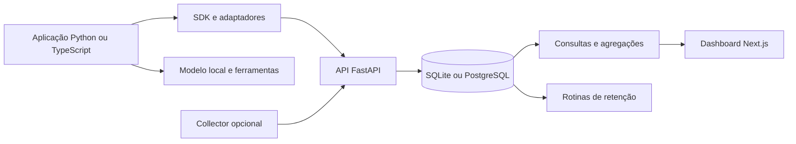

# AgentScope — plano de implementação e lançamento

**Versão:** 1.0 do plano  
**Estado:** planejamento; implementação ainda não iniciada por este documento  
**Responsáveis:** mantenedor do repositório e Codex  
**Repositório:** [glaugTbest/agentScope](https://github.com/glaugTbest/agentScope)  
**Orçamento:** sem contratação de serviços, infraestrutura ou APIs pagas

## 1. Objetivo

Transformar o MVP existente em uma plataforma open source de observabilidade para agentes de IA, instalável localmente e integrável a aplicações existentes.

O produto deve permitir acompanhar cada agente durante a execução, entender suas ações em linguagem natural, investigar erros, analisar desempenho e identificar oportunidades de reduzir consumo sem prejudicar a qualidade.

A experiência deve ser visualmente profissional, simples de aprender e sustentada por dados reais. A referência a um “Datadog de agentes” descreve a intenção de visibilidade operacional; não implica reproduzir toda a abrangência de uma plataforma de infraestrutura.

### Resultado esperado

Uma pessoa deve conseguir instalar o AgentScope, instrumentar uma aplicação, acompanhar agentes individualmente e demonstrar uma melhoria de eficiência com evidências reproduzíveis.

O primeiro lançamento será um produto local utilizável. Não será um serviço público com contas de clientes. O público inicial são desenvolvedores de pequenas equipes; colaboração simultânea com permissões de usuários fica para uma etapa posterior.

## 2. Decisões já alinhadas

| Tema | Decisão |
|---|---|
| Distribuição | Open source, instalado pelo próprio usuário |
| Público | Pequenas equipes que já usam ou estão construindo agentes |
| Sistemas existentes do mantenedor | Não há; serão criadas aplicações reais de referência |
| Integração inicial | Python, LangGraph e modelo local |
| Cliente compatível com OpenAI | Validar contra servidor local, sem afirmar validação da API hospedada |
| Evolução de integração | TypeScript e OpenTelemetry antes da versão 1.0 |
| Orçamento | Nenhuma chamada paga obrigatória; nenhum servidor pago |
| Execução | Computador do mantenedor |
| Segurança avançada | Fora da primeira versão |
| Conteúdo de prompts e respostas | Captura opcional, sanitização e retenção configurável |
| Idiomas | Interface em português e inglês |
| Documentação de distribuição | Inglês como principal, com versão em português |
| Aparência | Ferramenta profissional, temas claro e escuro |
| Nome do repositório | Manter AgentScope; não renomear automaticamente |
| Equipe | Mantenedor e Codex |
| Prazo | Entregas por critérios de conclusão; sem data artificial de lançamento |

Este plano atualiza a direção do produto em relação ao MVP anterior. Os documentos antigos descrevem o histórico e não devem ser interpretados como prova de funcionalidades concluídas. Na implementação, suas divergências serão reconciliadas em uma tarefa específica de documentação.

## 3. Base existente e lacunas

Referências locais: [STATUS.md](../STATUS.md), [README.md](../README.md), [MVP original](../AGENTSCOPE-MVP.md), [arquitetura atual](architecture.md) e [plano anterior de fechamento](delivery-plan.md).

O diagnóstico abaixo resulta de leitura dos arquivos e do código, não de execução dos testes nesta etapa de planejamento.

| Área | Base encontrada | Trabalho necessário |
|---|---|---|
| Backend | FastAPI, Pydantic, SQLAlchemy e Alembic | Modularização pontual, contratos novos e operação reproduzível |
| Banco | SQLite | Preservar modo local e validar PostgreSQL opcional |
| Ingestão | Trace completo e imutável após encerramento | Recebimento incremental e acompanhamento de execuções abertas |
| Identidade | Nome do agente no trace | IDs estáveis por agente, instância, execução e versão |
| SDK | Context managers e envio síncrono ao encerrar | Exportação em segundo plano, contexto assíncrono e integrações |
| Métricas | Totais e médias | Séries temporais, percentis e resultados por agente |
| Custos | Valor informado pelo cliente | Origem explícita, reconciliação e simulação separada |
| Dashboard | Cadastro, seleção, resumo e waterfall | Jornadas de integração, atividade atual e análise de eficiência |
| Demo | Cenários sintéticos | Exemplos com inferência e ferramentas reais |
| E2E | Script que apenas imprime um aviso | Testes de navegador executáveis e verificáveis |
| Qualidade | Testes iniciais de API e SDK | Contratos, recuperação, migrações e validação real |

Preservar o que já funciona. Refatorar quando necessário para uma entrega concreta, sem reescrever o projeto inteiro.

## 4. Hardware e estratégia de inferência gratuita

### 4.1 Ambiente informado

| Componente | Hardware |
|---|---|
| Memória RAM | 32 GB |
| GPU | NVIDIA GeForce RTX 3060 Ti |
| CPU | AMD Ryzen 5 7600X |
| Sistema de desenvolvimento | Windows, conforme ambiente atual do repositório |

Antes de instalar modelos, confirmar espaço livre em disco, memória de vídeo disponível, driver e versões dos runtimes. Não depender de uma capacidade de GPU presumida sem medir a máquina real.

O hardware permite planejar experimentos com modelos compactos locais. O tamanho utilizável e a velocidade serão determinados por benchmark, pois quantização, contexto, cache e concorrência alteram o consumo de memória.

### 4.2 Runtime e modelo de referência

- Usar Ollama local como candidato inicial de execução.
- Começar com um modelo da classe de 4 bilhões de parâmetros, quantizado, com suporte a ferramentas; `qwen3:4b` é o candidato inicial a avaliar.
- Registrar versão do runtime, tag, digest do modelo, quantização, licença e parâmetros utilizados.
- Começar com contexto de aproximadamente 4 mil tokens e uma geração ativa por vez.
- Avaliar contexto maior e duas gerações concorrentes apenas após medir memória e qualidade.
- Compartilhar o mesmo modelo entre pesquisador, redator e revisor, com instruções e estado separados.
- Não carregar um modelo distinto por agente como requisito da demo.
- Usar um modelo menor como alternativa para testes rápidos, caso o candidato inicial tenha latência inadequada.
- Desabilitar recursos de nuvem quando disponíveis e conferir que o endpoint selecionado é local.

O catálogo oficial apresenta o [Qwen3 4B](https://ollama.com/library/qwen3:4b). O Ollama documenta [chamadas de ferramentas](https://docs.ollama.com/capabilities/tool-calling), mas a confiabilidade do modelo nas tarefas do projeto será comprovada pelos testes.

### 4.3 O que significa “gratuito”

Não contratar APIs, hospedagem, domínio ou serviços de observabilidade. Downloads iniciais exigem internet e armazenamento. Energia elétrica e hardware existente não serão apresentados como custos inexistentes; apenas não haverá cobrança de API no percurso local.

Depois de instalar dependências e baixar o modelo, a suíte de agentes locais deve funcionar sem acesso a serviços externos. Testar essa condição explicitamente.

### 4.4 Benchmark inicial obrigatório

Medir inicialização a frio, execução com modelo já carregado, tempo até primeiro token, tempo total, tokens por segundo quando disponíveis, RAM e VRAM totais do processo de inferência.

Executar tarefas curtas de texto e ferramentas. Comparar uma e duas solicitações simultâneas. Separar espera na fila do modelo, inferência e sobrecarga do AgentScope.

O resultado define a configuração padrão da demo. Não publicar uma promessa de velocidade antes dessa medição.

## 5. Escopo de entrega

### 5.1 Alpha funcional

- Instalação local reproduzível.
- SDK Python integrado a um agente real local.
- Identidade de agente, instância e execução.
- Atividade em andamento e histórico.
- Tokens, duração e resultado individual.
- Dashboard com página de agente e detalhe de execução.
- Testes automáticos essenciais e primeiro E2E real.

### 5.2 Beta utilizável

- Aplicações de referência com RAG, colaboração e análise de dados.
- Adaptador LangGraph e cliente compatível com OpenAI validado localmente.
- Séries temporais, filtros persistidos e comparação entre versões.
- Custos simulados, catálogo de preços e recomendações por regras.
- SDK resiliente e migrações verificadas.
- Interface em português e inglês, temas claro e escuro.
- Instalação opcional com PostgreSQL e Compose validada localmente.

### 5.3 Versão 1.0

- SDK TypeScript com um exemplo real.
- Entrada OpenTelemetry com escopo de compatibilidade documentado.
- Comparação de qualidade e eficiência com evidências.
- Retenção, exportação, backup e restauração.
- Sabatina funcional, de falhas, desempenho e usabilidade concluída.
- Release reproduzível, documentação e demonstração pública sem dados privados.

### 5.4 Fora da primeira versão

Login corporativo, cobrança de assinaturas, multiusuário com isolamento entre clientes, gateway obrigatório, bloqueio de ferramentas, aprovação de ações, execução remota de agentes pelo painel, editor visual de agentes, marketplace e infraestrutura Kubernetes.

Alertas da primeira versão serão avisos no próprio painel. Webhooks e outros canais externos podem vir depois, sem bloquear o lançamento.

## 6. Jornadas e organização da interface

### 6.1 Navegação

| Área | Conteúdo |
|---|---|
| Visão geral | Agentes ativos, volume, tokens, custos e falhas |
| Agentes | Identidade, atividade, instâncias e gráficos individuais |
| Execuções | Busca, filtros, timeline, delegações e resultados |
| Eficiência | Comparações, recomendações e experimentos |
| Integrações | Exemplos de instrumentação e diagnóstico de conexão |
| Configurações | Preferências locais, retenção, privacidade e tarifas |

### 6.2 Primeiro uso

1. Iniciar o AgentScope.
2. Escolher entre exemplo real local e integração de aplicação existente.
3. Verificar disponibilidade do runtime e do modelo, quando necessário.
4. Copiar um exemplo mínimo de instrumentação.
5. Executar a aplicação.
6. Ver o agente aparecer automaticamente na primeira telemetria.
7. Abrir a execução em andamento.

Cadastro manual não será uma exigência para observar o primeiro agente. Nome e descrição poderão ser personalizados depois.

Meta: até dez minutos entre serviços já instalados e primeiro trace de aplicação própria. O download inicial do modelo será medido separadamente.

### 6.3 Investigação

Permitir navegar de um ponto no gráfico para as execuções correspondentes; da execução para a etapa; da etapa para uso, resultado e erro sanitizado. Manter filtros ao voltar.

### 6.4 Apresentação visual

- Tipografia legível, espaços consistentes e hierarquia clara.
- Identidade visual própria, sem copiar a marca Datadog.
- Cores previsíveis para estados, acompanhadas de texto ou ícones.
- Gráficos com unidade, legenda, intervalo e indicação de amostras.
- Temas claro e escuro, com preferência persistida.
- Navegação por teclado, foco visível e respeito à redução de movimento.
- Atualizações sem roubar foco, reposicionar tabela ou provocar saltos de layout.
- Visão principal útil em notebook; consulta responsiva em telas menores.
- Conteúdo avançado revelado progressivamente.
- Estados de carregamento, ausência de dados, erro e desatualização tratados.
- Internacionalização desde os primeiros componentes; formatadores por localidade.

O mapa de colaboração será complementar. Listas e timelines devem continuar úteis quando houver muitos agentes.

## 7. Modelo de domínio

| Entidade | Responsabilidade |
|---|---|
| Projeto | Agrupar aplicações e dados no ambiente local; não representa isolamento de clientes |
| Agente | Identidade lógica estável e finalidade |
| Versão do agente | Referência de código, prompt ou configuração para comparações |
| Instância | Processo ou worker que executa o agente |
| Tarefa | Objetivo de negócio que pode envolver vários agentes |
| Execução do agente | Participação individual em uma tarefa |
| Trace e span | Correlação distribuída e operações observadas |
| Evento de atividade | Mudança de estado ou progresso durante uma operação |
| Registro de uso | Consumo único de uma chamada ao modelo ou ferramenta |
| Avaliação | Resultado do critério de qualidade aplicado à tarefa |
| Experimento | Comparação entre baseline e variante |

Preservar IDs internos onde possível e mapear explicitamente IDs OpenTelemetry. Não forçar UUIDs com hífens sobre IDs de trace/span recebidos em outro formato válido.

Cada span executado por um agente deve permitir atribuir seu consumo ao agente correto. Uma tarefa pode conter várias execuções e traces relacionados. Relações de delegação e links devem representar processos distribuídos sem exigir uma árvore perfeitamente contida no tempo.

O custo direto pertence a quem realizou a chamada. O custo inclusivo pode agregar descendentes, com identificação visual. Totais gerais usam registros únicos de consumo e não somam novamente agregados de pais e filhos.

## 8. Atividade ao vivo e linguagem natural

### 8.1 Estados

Estados propostos de execução: iniciada, executando, aguardando ferramenta, aguardando outro agente, aguardando usuário, concluída, falhou, cancelada e sem atualização recente.

“Sem atualização recente” indica falta de evidência de progresso; não prova falha ou encerramento do agente.

Erro de uma etapa e resultado da tarefa são informações distintas. Uma execução pode concluir após recuperar de um timeout. Uma execução tecnicamente bem-sucedida pode falhar na avaliação da resposta.

### 8.2 Eventos mínimos

- Início e término da execução.
- Início e término de span.
- Atualização de atividade.
- Solicitação e conclusão de delegação.
- Espera e retomada.
- Erro, retry e recuperação.
- Cancelamento e resultado final.

### 8.3 Frases baseadas em evidências

Exemplos:

> Consultando documentos. Duas buscas concluídas; aguardando a terceira.

> A ferramenta excedeu o tempo limite. Iniciando a segunda tentativa.

> Encaminhou a revisão ao agente Revisor. Aguardando resposta.

Gerar essas descrições por regras e templates a partir de eventos estruturados. Cada frase deve apontar para o evento de origem. Se a informação não existir, exibir a limitação.

Não presumir intenções internas nem expor raciocínio oculto como atividade observada. Resumos por LLM são uma evolução opcional; não são necessários para entregar linguagem natural na primeira versão.

### 8.4 Transporte ao dashboard

Começar com consultas incrementais por cursor a cada um ou dois segundos durante execução, com intervalo maior quando ocioso e pausa em aba oculta. Buscar apenas mudanças e evitar recalcular todos os gráficos a cada atualização.

Permitir pausar visualmente o acompanhamento e mostrar quando os dados estão desatualizados. Avaliar SSE apenas se o mecanismo inicial não cumprir as metas.

## 9. Contrato de ingestão e confiabilidade

Introduzir contrato versionado para eventos incrementais. Preservar o endpoint de batch atual durante uma janela documentada de migração.

### Regras

- Evento com ID único, versão de schema, origem, momento de ocorrência e de recebimento.
- Persistência durável antes de confirmar sucesso ao cliente.
- Reenvio idempotente com constraints de banco.
- Detecção explícita de conflito: mesmo ID com conteúdo incompatível.
- Estado derivado resistente a eventos fora de ordem.
- Evento antigo de início não pode reabrir uma execução já encerrada.
- Pais ainda não recebidos podem ser reconciliados posteriormente.
- Execuções incompletas devem continuar inspecionáveis.
- Uso provisório e final não pode ser somado duas vezes.
- Limites por lote, atributo, conteúdo e profundidade.
- Datas normalizadas em UTC; duração local baseada em relógio monotônico.
- Clock skew entre processos sinalizado, sem inventar ordem causal absoluta.

Eventos persistidos e estado consultável podem compartilhar a mesma transação inicialmente. Não introduzir uma plataforma genérica de event sourcing.

### SDK

- Buffer em memória com limite configurável.
- Exportação em segundo plano e envio por lotes.
- Retry com espera progressiva, aleatoriedade e respeito a respostas de limitação.
- Timeout limitado, flush explícito e desligamento com prazo máximo.
- Preservação de exceções da aplicação.
- Contexto correto em tarefas assíncronas, threads e subprocessos, com limites documentados.
- Contadores de descartes e falhas de exportação.
- Nenhuma falha de telemetria interrompe o agente por padrão.
- Não exportar conteúdo sensível em logs de diagnóstico do próprio SDK.

O buffer em memória pode perder eventos ainda não confirmados se o processo morrer. Documentar a janela; spool em disco é opcional futuro, não requisito inicial.

## 10. Integrações e interoperabilidade

### Matriz planejada

| Integração | Alpha | Beta | 1.0 |
|---|---|---|---|
| Python manual | Completa para cenário inicial | Resiliente e documentada | Estável |
| Ollama local | Agente simples real | Streaming, ferramentas e cancelamento | Matriz certificada |
| LangGraph | — | Adaptador e exemplo real | Matriz certificada |
| Cliente OpenAI contra Ollama | — | Subconjunto validado localmente | Limitações publicadas |
| API hospedada OpenAI/Anthropic | — | Contratos simulados opcionais | Não certificada sem teste real |
| TypeScript | — | Planejamento do SDK | Exemplo real e SDK documentado |
| OpenTelemetry | Contrato preparado | Mapeamento definido | OTLP/HTTP traces no escopo publicado |

O Ollama fornece [compatibilidade com um subconjunto da API OpenAI](https://docs.ollama.com/api/openai-compatibility). Usar o cliente OpenAI com endpoint local não comprova comportamento do serviço hospedado nem de todos os seus endpoints.

O adaptador [LangGraph](https://docs.langchain.com/oss/python/langgraph/overview) deve observar execução e estado sem substituir o framework. Reutilizar interfaces públicas, evitando patches globais frágeis.

### OpenTelemetry

- Usar contratos oficiais de [OTLP](https://opentelemetry.io/docs/specs/otlp/).
- Delimitar primeiro OTLP/HTTP com traces; gRPC, logs e métricas genéricos ficam fora do compromisso inicial.
- Mapear convenções GenAI com versão registrada e preservar atributos desconhecidos dentro dos limites.
- Correlacionar HTTP, tarefas em fila, agente e ferramenta.
- Permitir integração opcional com Collector; ele não será obrigatório para o uso local simples.
- Testar propagação do contexto entre dois processos.
- Evitar duplicação de consumo entre instrumentação do framework e do provedor.
- Publicar claramente quais informações são capturadas por cada adaptador.

Spans exportados apenas ao terminar não revelam o início de uma operação em andamento. A experiência ao vivo completa exige eventos adicionais de atividade. Integrações apenas OTLP terão essa limitação indicada até fornecerem os eventos correspondentes.

## 11. Métricas individuais e análise de eficiência

| Métrica | Definição |
|---|---|
| Volume | Execuções iniciadas ou concluídas por intervalo, identificando qual |
| Concorrência | Execuções ativas simultaneamente |
| Tokens | Entrada e saída, com categorias adicionais quando informadas |
| Velocidade de geração | Tokens de saída divididos pelo tempo de geração observado |
| Latência | Duração total e p50, p95, p99, com tamanho da amostra |
| Primeiro token | Tempo até primeiro fragmento recebido, quando disponível |
| Falha terminal | Execução encerrada com falha não recuperada |
| Recuperação | Execução concluída após erro intermediário |
| Qualidade | Aprovação por critério de tarefa versionado |
| Custo por tarefa aprovada | Custo do conjunto, incluindo falhas, dividido por aprovações |
| Uso por tarefa aprovada | Tokens do conjunto divididos pelas tarefas aprovadas |
| Ocupação | Tempo ocupado sobre capacidade conhecida; omitir quando não conhecida |

Sem amostras ou denominador válido, mostrar indisponível. Não usar zero como substituto para informação ausente.

CPU, GPU e RAM serão inicialmente métricas opcionais do processo/host, sem atribuição arbitrária a cada agente. Um servidor de inferência compartilhado não fornece automaticamente consumo físico individual confiável.

### Gráficos

- Tokens e custo ao longo do tempo.
- Execuções, concorrência e falhas.
- Latência e distribuição por etapa.
- Consumo por modelo e ferramenta.
- Custo e tokens por tarefa aprovada.
- Comparação entre versões e períodos.
- Relação entre qualidade, duração e consumo.

Filtros: agente, instância, versão, ambiente, tarefa, resultado, modelo e período. Filtros devem ser persistidos na URL, aplicados de forma consistente a totais e detalhes e funcionar com paginação.

Não somar durações de spans paralelos para representar duração total. Diferenciar tempo de parede, tempo acumulado de operações e espera quando mensurável.

## 12. Custos reais, desconhecidos e simulados

### 12.1 Três categorias explícitas

| Categoria | Apresentação |
|---|---|
| Cobrança de API local inexistente | “Sem cobrança de API”; infraestrutura não calculada |
| Custo estimado de provedor | Baseado em uso capturado e tarifa identificada |
| Simulação financeira | “Simulação”: aplicação de uma tarifa de cenário ao consumo |

Não misturar custos simulados com valores reais nos totais por padrão. Não converter custo desconhecido em zero.

### 12.2 Contabilização

- Registro único por chamada faturável ou operação cobrada.
- Fonte de tokens: informados pelo runtime/provedor, estimados ou indisponíveis.
- Preços com moeda, fonte, data de vigência e versão.
- Tarifas fictícias permitidas em fixtures, sempre identificadas.
- Preços públicos só utilizados como reais após verificação na fonte oficial.
- Valores inteiros com capacidade suficiente ou decimal apropriado; validar limites em SQLite e PostgreSQL.
- Manter custo histórico quando uma tarifa mudar; recálculo deve ser explícito.
- Tratar categorias de cache e raciocínio conforme sua relação com os totais, evitando dupla contagem.
- BRL pode ser moeda de cenário informada pelo usuário; não inventar câmbio atual.

### 12.3 Recomendações iniciais

| Evidência | Experimento sugerido |
|---|---|
| Muitas tentativas por tarefa | Corrigir ferramenta ou política de retry |
| Contexto crescente | Limitar histórico ou reduzir documentos recuperados |
| Chamadas repetidas equivalentes | Avaliar cache |
| Etapa simples com consumo elevado | Comparar modelo menor |
| Ferramentas sem contribuição observável | Simplificar fluxo |
| Nova versão consome mais com mesma qualidade | Investigar regressão |

Cada recomendação deve informar regra acionada, amostra, execuções de evidência, hipótese, limitações e comparação proposta. Não calcular pontuação opaca de “inteligência” ou “eficiência”.

Economia potencial não é economia demonstrada. Na comparação entre modelos diferentes, usar os tokens de cada execução; tokenizadores distintos impedem tratar a mesma contagem como garantida.

O painel pode avisar sobre orçamento de cenário. Não afirmar bloqueio financeiro, pois a plataforma não está no caminho de autorização da chamada.

## 13. Arquitetura de implementação



- Preservar o monorepo, FastAPI, SQLAlchemy, Alembic, Next.js e TypeScript.
- SQLite continua sendo o início rápido; um processo de API no perfil local padrão.
- PostgreSQL é um perfil opcional validado para maior concorrência em ambiente confiável.
- Instalação nativa no Windows como percurso inicial; Compose opcional depois.
- Dashboard lê a API e não acessa o banco diretamente.
- Regras de agregação ficam no backend.
- Índices por projeto, agente, execução, estado e tempo, guiados por consultas reais.
- Paginação por cursor e carregamento sob demanda em datasets maiores.
- Rotina de retenção simples, agendada pelo operador ou comando documentado.
- Redis, Kafka, ClickHouse e Kubernetes só entram após um gargalo medido justificar a mudança.

### Organização sugerida

```text
apps/api/                 ingestão, consultas, migrações e retenção
apps/web/                 interface e rotas de comunicação com API
packages/sdk-python/      SDK e adaptadores Python
packages/sdk-typescript/  SDK TypeScript na etapa correspondente
examples/                 agentes reais e demo sintética identificada
tests/integration/        fluxos completos e contratos
tests/e2e/                navegador
benchmarks/               cargas, datasets e relatórios
docs/                     instalação, conceitos, evidências e releases
```

Essa estrutura é uma proposta, não uma declaração de diretórios já existentes.

## 14. Cuidados básicos e privacidade

Segurança avançada foi retirada da primeira versão por decisão do mantenedor. O escopo continua local e confiável.

Preservar somente os cuidados necessários para um produto responsável:

- Serviços escutando em loopback por padrão.
- Segredos e arquivos de ambiente fora do Git.
- Captura de conteúdo desabilitada até ativação explícita.
- Sanitização de conteúdo, metadata, erros e stack traces.
- Conteúdo recebido renderizado como dado, sem executar HTML ou instruções.
- Limites de ingestão e mensagens de diagnóstico sem segredos.
- Chave local existente preservada sem fingir que oferece isolamento multiusuário.
- Credenciais dos modelos permanecem na aplicação observada, quando houver.
- Demo pública composta somente de dados preparados e sanitizados.

Não publicar a API local na internet como serviço aberto. A demonstração pública será gravação ou interface estática com dataset, sem ingestão de visitantes.

## 15. Sabatina com agentes reais gratuitos

### 15.1 O que caracteriza um teste real

O modelo deve executar inferência e participar das decisões de uso de ferramentas. Ferramentas devem ler documentos, consultar dados ou executar operações locais reais. Resultado, eventos e métricas devem percorrer o SDK, a API, o banco e a interface.

Dados de teste podem ser sintéticos. Isso não torna a inferência simulada. Distinguir sempre origem dos dados, origem dos eventos e execução real ou simulada do modelo.

### 15.2 Aplicações de referência

| ID | Aplicação | Ferramentas | Critério verificável |
|---|---|---|---|
| REAL-01 | Assistente de documentos | Busca e leitura de corpus local | Resposta apoiada nas fontes esperadas |
| REAL-02 | Pesquisador, redator e revisor | Busca, delegação e revisão | Participação individual e artefato com critérios atendidos |
| REAL-03 | Analista de dados | Consultas de leitura a SQLite de teste | Resultado numérico ou conjunto de registros correto |
| REAL-04 | Assistente com streaming | Modelo local e ferramenta curta | Primeiro fragmento, cancelamento e término observados |
| REAL-05 | Execução distribuída | Aplicação e worker em processos separados | Contexto e delegação preservados |
| REAL-06 | Agente TypeScript | Modelo local e consulta de dados | Mesmo contrato de observabilidade do Python |

O primeiro RAG pode usar busca lexical local. Embeddings só serão adicionados se melhorarem a tarefa ou forem necessários a uma integração, evitando carregar modelos extras sem benefício demonstrado.

### 15.3 Dataset e repetição

- Preparar pelo menos dez tarefas por aplicação central REAL-01, REAL-02 e REAL-03.
- Executar três repetições por tarefa: 90 execuções de tarefa na rodada básica, além das chamadas internas de agentes.
- Incluir casos fáceis, ambíguos e sem informação suficiente.
- Registrar resultados esperados e critérios antes da execução.
- REAL-04 a REAL-06 terão cenários específicos de contrato e comportamento, sem repetir artificialmente a mesma matriz.
- Registrar prompts, versões e configurações sanitizados para reprodução.
- Avaliação automática determinística quando possível; revisão humana nas tarefas abertas.
- Não depender de um LLM avaliando sozinho a própria resposta.

Falhas do modelo devem aparecer como falhas do resultado; nunca ser ocultadas para produzir uma demo aparentemente perfeita.

### 15.4 Comparação de eficiência

1. Congelar dataset e critérios de aceitação.
2. Executar baseline.
3. Alterar uma variável: contexto, retry, cache ou modelo.
4. Repetir tarefas e configurações comparáveis.
5. Comparar qualidade, tokens, chamadas, latência e custos de cenário.
6. Registrar a variabilidade e não fazer alegações estatísticas fortes com amostras pequenas.

Na comparação de overhead, intercalar execuções com e sem observabilidade e separar aquecimento. Controlar seed quando suportada, sem presumir determinismo completo.

## 16. Sabatina de falhas e integridade

| Caso | Resultado esperado |
|---|---|
| Timeout de ferramenta | Etapa falha identificada e contexto preservado |
| Erro seguido de retry bem-sucedido | Falha intermediária visível; tarefa pode concluir |
| Loop de ferramentas | Limite do exemplo encerra a tarefa; consumo registrado |
| Cancelamento de streaming | Estado cancelado, uso final ou incompleto identificado |
| Processo do agente encerrado abruptamente | Dados recebidos preservados; execução incompleta sinalizada |
| API de observabilidade desligada | Agente continua; SDK respeita buffer e timeout |
| Buffer esgotado | Descarte contado, memória limitada e diagnóstico claro |
| Rede interrompida e restaurada | Reenvio sem duplicar eventos confirmados |
| Evento duplicado | Totais permanecem iguais |
| Evento fora de ordem | Estado final correto ou incompletude explícita |
| Reinício da API após confirmação | Evento confirmado permanece disponível |
| Banco indisponível | Sem confirmação falsa; SDK recebe falha tratável |
| Nome igual em projetos diferentes | Identidade e consultas permanecem separadas logicamente |
| Dupla instrumentação | Uma única cobrança por chamada |
| Dado ausente de tokens | Exibir indisponível, sem fabricar zero |
| Conteúdo com credencial fictícia | Sanitização validada antes de persistência/exportação |
| HTML em output da ferramenta | Renderização inerte |
| Exclusão por retenção | Dados, conteúdos e agregados associados tratados consistentemente |

Injeção de falhas de API externa será identificada como simulada. Não requer pagar um provedor para comprovar a resiliência do transporte.

## 17. Testes automáticos e CI

### Camadas

| Camada | Cobertura |
|---|---|
| Unidade | Estados, formatação, custos e filtros |
| Propriedades | Reordenação, repetição, reconciliação e hierarquias |
| Contrato | Schemas, SDKs, adaptadores e compatibilidade |
| Integração | SDK → API → banco → consulta |
| Migrações | Banco limpo e atualização a partir de versões anteriores |
| E2E | Integração, atividade atual, filtros, detalhe e configuração |
| Carga | Escrita concorrente e leituras do painel |
| Resiliência | Interrupção, reinício e recuperação |
| Agentes reais | Inferência local e ferramentas reais |
| Usabilidade | Tarefas de navegação e diagnóstico |

### Execução

- Em pull requests: lint, tipos, testes determinísticos, contratos e E2E essencial com serviços temporários.
- Em marcos de entrega: testes de migração em SQLite e PostgreSQL.
- Na máquina local: suíte real com GPU, benchmark e testes prolongados.
- Em release candidata: toda a matriz aplicável e relatório de evidências.
- Nenhuma credencial paga ou GPU hospedada é necessária ao pipeline obrigatório.
- Validar disponibilidade e limites dos recursos gratuitos de CI antes de configurar; manter percurso local equivalente.
- Nunca usar o banco pessoal de desenvolvimento como banco de testes.
- O script E2E deve executar testes e falhar quando não puder fazê-lo; um aviso não conta como aprovação.

Publicar comandos documentados somente quando existirem. Até a implementação, nomes de comandos novos são propostas de contrato de desenvolvimento.

## 18. Desempenho e orçamento de recursos

As metas abaixo são alvos de engenharia, não medições atuais. Revisar após o primeiro benchmark e registrar qualquer ajuste com justificativa.

| Área | Meta inicial |
|---|---|
| Atividade visível | p95 até 3 s entre recebimento do evento e apresentação no painel local |
| Consultas usuais | p95 até 500 ms no cenário de referência |
| Navegação principal | Conteúdo útil até 2 s no ambiente de benchmark |
| Instrumentação | Overhead p95 até 2% em tarefas reais; também informar aumento absoluto |
| Memória do SDK | Limite padrão proposto de 16 MiB para buffer; validar overhead total separado |
| Recuperação | Nenhuma perda de evento confirmado nos cenários testados |
| Contabilização | Totais reproduzíveis a partir dos registros únicos |
| Setup | Até 10 min para primeira integração após dependências disponíveis |

### Perfis de carga

1. Pequeno: 10 mil spans, três agentes e navegação interativa.
2. Médio: 100 mil spans, consultas simultâneas e 100 spans/s de ingestão sintética.
3. Referência ampliada: 1 milhão de spans e busca do limite sustentável.

Registrar tamanho médio do evento, tamanho de conteúdo, hardware, banco, quantidade de leitores e duração. Não apresentar spans/s como quantidade de agentes executando inferência.

Rodar carga sustentada por 30 minutos no perfil médio e ensaio de estabilidade de quatro horas com telemetria sintética. Executar a suíte real separadamente para medir o impacto da inferência no mesmo computador.

Investigar crescimento de memória após aquecimento. O runtime do modelo deve ser separado dos números de consumo da API e do dashboard.

### Otimizações permitidas por evidência

Índices adequados, consultas filtradas antes de agregação, paginação, projeção de campos, redução de frequência de polling, agregações por janela e carregamento sob demanda.

Percentis agregados não podem ser calculados pela média de percentis menores. Adotar cálculo correto para o volume inicial e método aproximado identificado se necessário depois.

Amostragem de traces não pode distorcer silenciosamente tokens e custos. Manter contabilização completa separada ou informar que o total é uma estimativa e como foi obtido.

## 19. Retenção, operação e recuperação

- Configurar retenção por idade, com perfil local inicial sugerido de sete dias para conteúdo e trinta dias para eventos, ajustável pelo operador.
- Permitir desabilitar retenção automática e mostrar espaço ocupado.
- Definir o destino de agregados após exclusão: remover ou preservar apenas estatísticas explicitamente documentadas.
- Excluir conteúdo sem deixar cópias esquecidas em exports temporários ou logs.
- Exportar execução em JSON sanitizado e métricas em CSV com proteção contra fórmulas executáveis.
- Documentar backup consistente de SQLite e backup/restauração de PostgreSQL.
- Testar restauração e abertura das execuções recuperadas.
- Medir saúde da ingestão, erros, latência, descartes e volume de armazenamento.
- Evitar recursão ao observar a própria plataforma.

## 20. Etapas e entregáveis

### Etapa 0 — consolidar decisões e baseline

**Entregas:** inventário real de funcionalidades, reconciliação dos documentos, convenções de identidade, wireframes das jornadas e benchmark inicial do modelo.

**Aceite:** configuração local escolhida com evidências; backlog em ordem de dependência; diferença entre recurso existente e planejado explícita.

### Etapa 1 — tornar a base reproduzível

**Entregas:** instalação nativa confiável, dependências registradas, isolamento de bancos, CI e E2E executável.

**Aceite:** uma instalação limpa inicia o produto e um teste automatizado grava e consulta um trace real do SDK.

### Etapa 2 — identidade e eventos incrementais

**Entregas:** entidades de agente/instância/execução, migrações, estados, ingestão idempotente e compatibilidade com batch antigo.

**Aceite:** dois agentes de mesmo nome lógico em contextos distintos não se confundem; uma execução é consultável antes de terminar; reenvios não duplicam métricas.

### Etapa 3 — SDK e primeiro agente real

**Entregas:** exportação em segundo plano, contexto assíncrono, exemplo local e frases de atividade por regras.

**Aceite:** agente usa uma ferramenta real e aparece ao vivo; indisponibilidade do AgentScope não interrompe a tarefa.

### Etapa 4 — dashboard individual

**Entregas:** visão geral, página de agente, instâncias, séries temporais, timeline, filtros e temas.

**Aceite:** usuário identifica agente ativo, etapa atual, tokens e causa de falha sem consultar logs externos.

### Etapa 5 — colaboração e integrações Python

**Entregas:** REAL-01 a REAL-03, LangGraph, cliente compatível com OpenAI local, delegações e reconciliação de consumo.

**Aceite:** pesquisador, redator e revisor observáveis individualmente; soma da equipe corresponde às chamadas únicas; inferência local comprovada.

### Etapa 6 — eficiência e custos

**Entregas:** registro de preços, cenários financeiros, avaliações, comparação de versões e recomendações com evidências.

**Aceite:** um experimento antes/depois é reproduzível; qualidade e consumo são apresentados juntos; valores simulados não aparecem como gasto real.

### Etapa 7 — TypeScript, OTLP e operação

**Entregas:** SDK TypeScript, REAL-05 e REAL-06, entrada OTLP delimitada, PostgreSQL opcional, retenção e restauração.

**Aceite:** aplicações Python e TypeScript compartilham contrato; contexto atravessa processos; dados persistidos sobrevivem à recuperação testada.

### Etapa 8 — sabatina e publicação

**Entregas:** relatório completo, correção de bloqueadores, instalação externa documentada, release, vídeo e demo gravada/estática.

**Aceite:** todos os critérios da versão 1.0 cumpridos ou limitações de integrações opcionais explicitamente publicadas; nenhuma alegação de validação paga sem evidência.

Não iniciar todas as etapas ao mesmo tempo. Cada etapa deve deixar o repositório utilizável e revisável. Datas serão estimadas depois das etapas 0 e 1, com base no tempo disponível do mantenedor e na complexidade constatada.

## 21. Checklist de liberação da versão 1.0

- [ ] Instalação limpa reproduzida no Windows.
- [ ] Percurso equivalente de API/SDK testado em Linux; outros sistemas identificados como testados ou não.
- [ ] Primeiro agente real integrado e visível antes de terminar.
- [ ] Três agentes da aplicação colaborativa com métricas separadas.
- [ ] Gráficos, filtros e detalhe coerentes entre si.
- [ ] Estados de retry, cancelamento e telemetria incompleta corretos.
- [ ] Tokens e custos sem dupla contagem.
- [ ] Custos locais, simulados e estimados diferenciados.
- [ ] SDK não interrompe a aplicação observada por falha de coleta.
- [ ] TypeScript e escopo OTLP demonstrados.
- [ ] Conteúdo opcional e sanitização testados.
- [ ] Backup, restauração e migrações verificados.
- [ ] E2E e testes determinísticos aprovados.
- [ ] Rodada real local e benchmark registrados.
- [ ] Usabilidade revisada pelo mantenedor; teste externo buscado quando houver voluntário, sem declarar validação externa inexistente.
- [ ] Interface em português/inglês e temas claro/escuro revisados.
- [ ] Documentação e matriz de compatibilidade condizem com a release.
- [ ] Nenhum segredo ou dado pessoal presente nos exemplos de publicação.
- [ ] Limitações operacionais e resultados negativos publicados.

## 22. GitHub, identidade e divulgação

### Repositório

Manter o repositório do usuário e o nome AgentScope. O README atual já registra um conflito possível de import Python. Antes da distribuição, avaliar um namespace exclusivo, como `agentscope_observability`, com migração documentada. Não renomear repositório ou pacote sem decisão específica.

Preparar README, documentação bilíngue, guia de contribuição, licença com autoria correta, changelog, templates de issues e releases versionadas. Não inventar identidade do titular da licença.

Pacotes e imagens terão publicação planejada após verificar disponibilidade dos nomes e permissões. Preparação de release não autoriza automaticamente postagem nas redes sociais.

### Demonstração sem hospedagem paga

Entrega obrigatória: vídeo ou GIF de execução real, dataset sanitizado e passos para reproduzir localmente.

Entrega opcional: interface estática navegável com dados gravados, publicada em uma opção gratuita somente após verificar condições vigentes. Identificar como replay, sem indicadores enganosos de execução ao vivo.

Sem domínio próprio, servidor permanente ou ingestão de dados de visitantes como requisito do lançamento.

### Conteúdo para LinkedIn e outras redes

1. Problema: dificuldade de saber o que agentes estão fazendo e consumindo.
2. Demonstração: três agentes reais locais com atividade e métricas individuais.
3. Investigação: uma falha, a recuperação e o impacto em consumo.
4. Experimento: redução de chamadas ou contexto, acompanhada de avaliação de qualidade.
5. Engenharia: instalação reproduzível, limites e testes de resiliência.

Publicar números somente com dataset, condições e versão de referência. Redução de tokens local não equivale automaticamente à mesma porcentagem de economia financeira em qualquer provedor.

## 23. Riscos e respostas previstas

| Risco | Resposta |
|---|---|
| Modelo local erra ferramentas | Melhorar instruções e schema; medir taxa de acerto; avaliar outro modelo compacto |
| GPU sem memória suficiente | Reduzir contexto, manter uma geração ativa e evitar modelos duplicados |
| Demo lenta | Mostrar espera real; ajustar tamanho das tarefas e separar replay de execução ao vivo |
| Escopo cresce | Preservar etapas; recursos fora da 1.0 não bloqueiam o núcleo |
| Telemetria altera latência | Exportação em segundo plano e benchmark contra baseline |
| Consumo duplicado | Registro único de chamada e testes de dupla instrumentação |
| API externa incompatível | Matriz de suporte e certificação somente após teste real |
| Modelo muda sob uma tag | Registrar digest e fixar artefato da rodada de validação |
| Banco cresce | Retenção, limites de conteúdo e métricas de armazenamento |
| Observabilidade parece explicar mais do que sabe | Frases ligadas a eventos e indicação de dados ausentes |

## 24. Evidências que devem acompanhar o projeto

Cada relatório de validação deve registrar commit, data, hardware, versões, digest do modelo, configuração, dataset, comandos, número de repetições, resultados, limitações e artefatos sanitizados.

São documentos distintos:

- Relatório de funcionamento com agentes reais locais.
- Relatório de desempenho da plataforma.
- Relatório de falhas e recuperação.
- Relatório de comparação de eficiência.
- Matriz de compatibilidade das integrações.

Um build aprovado não substitui teste real. Uma demo visual não substitui teste de integridade. Um contrato simulado não substitui validação de serviço externo.

## 25. Referências técnicas

As referências apoiam decisões, não constituem prova de integração implementada. Versões deverão ser verificadas e fixadas ao executar cada etapa.

- [Ollama: compatibilidade OpenAI](https://docs.ollama.com/api/openai-compatibility).
- [Ollama: chamadas de ferramentas](https://docs.ollama.com/capabilities/tool-calling).
- [Ollama: configuração e recursos](https://docs.ollama.com/faq).
- [Qwen3 4B no catálogo Ollama](https://ollama.com/library/qwen3:4b).
- [LangGraph: visão geral](https://docs.langchain.com/oss/python/langgraph/overview).
- [OpenTelemetry: protocolo OTLP](https://opentelemetry.io/docs/specs/otlp/).
- [OpenTelemetry: convenções semânticas](https://opentelemetry.io/docs/specs/semconv/).

## 26. Próxima ação após autorização de implementação

Executar a etapa 0: verificar ambiente e hardware disponível, reconciliar requisitos existentes e medir um agente local mínimo. Nenhuma instalação de modelo, chamada de inferência, alteração de aplicação, commit, push ou publicação é executada pela criação deste plano.
